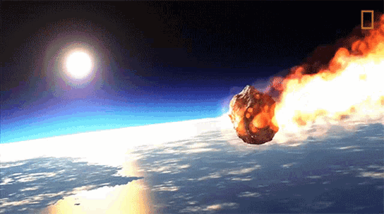

# Introduction



<style>
    body { background-color: dimgrey; }
    pre, pre:not([class]) { background-color: white; }
</style>

Dataset: https://catalog.data.gov/dataset/meteorite-landings

This data set includes Meteorite Landing data from The Meteoritical Society and NASA, which includes 34,513 confirmed meteorite landings around the globe. The data was last updated November 2020.


```{r setup, include=FALSE}
knitr::opts_chunk$set(echo = TRUE)
knitr::opts_chunk$set(warning = FALSE, message = FALSE) 
library(ggplot2)
library("plot3D")
library(ggthemes)
options(scipen=999)
landings = read.csv("Meteorite_Landings.csv")
```

<br>
<br>

### Summary
In the data set, meteorites have multiple different fields: Name, ID, NameType, Class, Mass (g), Fall, Latitude, Longitude, and GeoLocation. Each meteorite has its own unique Name and ID. NameType has two factors: valid and relict, where relict meteorites, "were once meteorites but are now highly altered by weathering on Earth". Class is the certain classification for different types of meteorites. Mass of meteorites is weighed in grams. Fall has two factors: found and fell, where fell meteorites were confirmed to have fallen but have not been found. Latitude and Longitude are both the coordinates for each meteorite.

```{r}
lands = na.omit(landings) #removes NA lines
colnames(lands) = c("Name","ID","NameType","Class","Mass","Fall","Year","Latitude","Longitude", "GeoLocation")
lands$Class = as.factor(lands$Class)
lands$Fall = as.factor(lands$Fall)
#lands$Year = as.factor(lands$Year)
lands$NameType = as.factor(lands$NameType)
summary(lands)

```

<br>

### Head
First 5 meteorites from the data set witht their respected data fields.

```{r}
head(lands)
```

<br>

### Structure
Structure of each field within the data set.

```{r}
str(lands)
```

<br>

### Max Weight
Meteorite with the highest weight(g). Hoba is the current largest meteorite found, impacting around 80,000 years ago in Africa.

```{r}
lands[which.max(lands$Mass),]
```

<br>

# Latitude vs. Longitude

### World Map

In this chart I plotted Latitude vs. Longitude where the size of each dot is dependent on the mass, while color is determined by whether the meteorite was found or not.

```{r}
qplot(data=lands, x = Longitude, y= Latitude, size=Mass, color=Fall)+ theme_solarized() +ggtitle("World-Wide Longitude vs. Latitude")

```

<br>

### United States

This chart filters the Latitude and Longitude to show the United States. More meteorites were found in the midwest.

```{r}
US = lands[lands$Longitude <= -50,]
US = US[US$Latitude >=0,]
qplot(data=US, x = Longitude, y= Latitude, size=Mass, color=Fall)+ theme_solarized()+ ggtitle("U.S.A. Longitude vs. Latitude")

```

<br>

# Yearly Visualizations

### Year vs. Mass

Meteorites discovered by Year vs. Mass where color is the class (legend hidden). Most meteorites were uncovered within the last 20 years or so.

```{r}
qplot(data = lands, x = Mass, y = Year, geom = "point",color = Class,show.legend = FALSE )+xlim(0,4000)+ylim(1600,2050)+ggtitle("Year vs. Mass")+ theme_solarized()

```

<br>

### Histogram

Histogram chart plotting Years found from 1850-1950, where color is whether or not if meteorite was found.

```{r}
ggplot(lands, aes(Year, fill = Fall)) +
  geom_histogram(bins = 30,col=I("black")) + xlim(1850,1950)+ ggtitle("1850-1950 Histogram")+ theme_solarized() + ylab("Frequency")
```

<br>

### NameType Frequency

Frequency of meteorites with the NameType of Relict, using freqpoly plot.

```{r}
pops = lands[lands$NameType == "Relict",]
ggplot(pops, aes(x = Year, color = Class)) +geom_freqpoly(binwidth=2, size = 2) + xlim(1970, 2015) + theme_solarized()+ggtitle("NameType: Relict") + ylab("Frequency")

```

# Linear Regression

### Mass vs Year of Class L6
This linear regression chart shows class L6 being filtered. Mass is limited from 0-1000g, while Year is limited from 1990-2000.
You can see that most of the metorites are smaller with more being found in recent years.

```{r}
L6Class = lands[lands$Class == "L6",]
test  = L6Class[L6Class$Year >= 1990 & L6Class$Year <= 2000,]
test = test[test$Mass <= 1000,]
x = test$Year
y = test$Mass
lr <- lm(y~x)
plot(x,y, main = "Linear Regression: Mass vs Year of L6", xlab = "Year: 1990-2000", ylab = "Mass: 0-1000g")
points( x, lr$coefficients[1] + lr$coefficients[2] * x, type="l", col=4)
```

<br>

# Facet

### Class Comparison
This facet chart showcases the Mass vs. Year of the 6 highest count classes. Year is limited from 1950-2000, and Mass from 0-2000g. Each class is filtered into its own dataframe then combined. 
You can see that class LL5 meteorites are found to be smaller than the other classes.

```{r}
H5Class = lands[lands$Class == "H5",]
L5Class = lands[lands$Class == "L5",]
H6Class = lands[lands$Class == "H6",]
H4Class = lands[lands$Class == "H4",]
LL5Class = lands[lands$Class == "LL5",]
Combo = rbind(H5Class, L6Class, L5Class, H6Class, H4Class, LL5Class)
#summary(test)
ggplot(data=Combo, aes(x=Year, y=Mass, color=Class)) + xlim(1950, 2000) + ylim(0,2000) + geom_point(size=2) + facet_grid(Class~.) + theme_solarized() + ggtitle("Class Comparison")

```

<br>

# Clustering 

### Latitude vs. Longitude

K-Means: from this graph I concluded that 3 clusters would be ideal for the latitude and longitude clustering chart.

```{r}
mat <- cbind( lands$Longitude, lands$Latitude)
mat = na.omit(mat)
clust = lands
wss <- rep(0,15)
for (k in 1:15)
  wss[k] <- sum( kmeans(mat,centers=k, nstart=50)$withinss)
plot(wss, type="b", main = "K-Means", xlab = "Index", ylab = "WSS" ) 
```

<br>

From this point chart, we can see that the clusters are separated by larger land masses.

```{r}
km = kmeans(mat,centers=3)$cluster
clust$cl <- factor( km)  
qplot(data=clust, x=Longitude,y=Latitude, color=cl)+ theme_solarized() + ggtitle("Clustering: Latitude vs. Longitude")
```

<br>

### 3D ScatterPlot

Instead of using total data, these 3D ScatterPlots use Class H5 where the years are over 1900. Most meteorites are found in recent years.

```{r}
smol = lands[lands$Year >= "1900",]
smol = smol[smol$Class == "H5",]

scatter3D(smol$Longitude,smol$Latitude,smol$Year, 
          main="Latitude vs. Longitude vs. Year",
          xlab = "Longitude",
          ylab = "Latitude",
          zlab = "Year")

mats <- cbind(smol$Longitude,smol$Latitude,smol$Year, col=NULL)

km = kmeans(mats,centers=3)$cluster
smol$cl <-  km  

scatter3D(smol$Longitude,smol$Latitude,smol$Year, colvar=smol$cl,iris[,1:3],
          main="Latitude vs. Longitude vs. Year",
          xlab = "Longitude",
          ylab = "Latitude",
          zlab = "Year")
```
